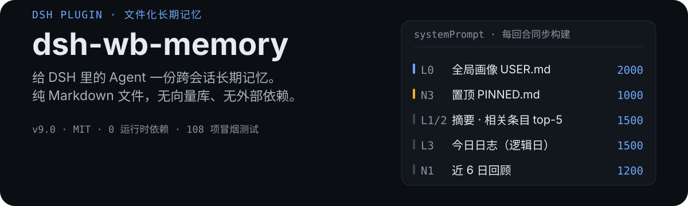

# dsh-wb-memory

<p align="center">
  
</p>

**给 DSH 里的 Agent 一份跨会话长期记忆。** 记忆就是工作区里的 Markdown 文件——没有向量库、没有外部服务、没有运行时依赖；每回合按 token 预算分层注入到 `systemPrompt`。

- **看得见、能 grep、能进 git**：真值源是 `<工作区>/.workbuddy/memory/` 下的普通 Markdown，Agent 自己也能直接读写
- **零运行时依赖**：只用 Node 内置模块，不引第三方包
- **后台自己维护**：流水、提炼、整理、治理四个流程自动跑，不需要你手工整理记忆

## 快速开始

在你的 profile 里做两件事：装依赖、把插件名加进 bundle 列表。

```json
{
  "dependencies": {
    "dsh-wb-memory": "link:C:/Users/<你>/.dsh/plugins-dev/dsh-wb-memory"
  },
  "dsh": {
    "profile": {
      "bundles": ["@deepseek-ai/dsh-base", "@deepseek-ai/dsh-web-app", "dsh-wb-memory"]
    }
  }
}
```

然后重启 DSH 宿主。插件通过自己的 `cordis.patch.yml`（由 `package.json` 的 `dsh.bundle.patch` 字段声明）插进 profile 的层栈，不用手改 profile 的其它配置。

启用后确认两件事：

1. 设置面板出现 wb-memory 页签，总闸 `enabled` 为开；
2. 面板里选好「当前激活工作区」——会话 cwd 落在 `<记忆根>/<工作区>/` 下会自动匹配，不落在时用面板这个值兜底。

记忆目录不需要预先创建，第一次写入时会自己建。已在 DSH 0.1.7-rc.2 + Node 24（Windows）上日常使用。

## 它会往上下文里塞什么

注入块同步拼装，结构固定、顺序固定：

```
# WorkBuddy 记忆（由 dsh-wb-memory 插件注入，启用时生效）
## 全局用户记忆（USER.md）                       ← L0 全局画像
## 当前工作区：程序开发（已自动匹配）
### 置顶记忆（PINNED.md，用户明确钉住，长期有效）  ← N3 优先级最高
### 长期记忆 / 相关条目（按当前任务召回 top-5）   ← L2 召回；注入时机拿不到
### 长期记忆 / 摘要（完整内容请按需读取 MEMORY.md）     用户消息时退化为 L1
### 今日日志（2026-09-26.md）                   ← L3 保尾截断
## 近 6 日回顾（2026-09-20 ~ 2026-09-25）        ← N1 零 LLM
## 可用工作区
## 记忆纪律                                      ← 读/何时写/不写/写到哪/冲突消解
```

长期记忆的正文**不**全量注入：只给条目标题和首行，细节留给 Agent 用文件工具按需打开，或用 `memory_search` 工具按关键词召回。

| 层 | 内容 | 预算（config.json） | 截断方式 |
| --- | --- | --- | --- |
| L0 | 插件目录 `USER.md` 全局画像 | `profileMaxChars` = 2000 | 保头 |
| N3 | 工作区 `PINNED.md` 置顶 | `pinnedMaxChars` = 1000 | 保头并标注 |
| L1 | `MEMORY.md` 条目标题 + 首行 | `summaryMaxChars` = 1500 | 按条目预算 |
| L2 | `MEMORY.md` 相关条目 top-K | `relevantTopK` × `entryMaxChars` | 每条 800 |
| L3 | 当日日志 | `logMaxChars` = 1500 | 保尾（最新记录在文件尾部） |
| N1 | 近 `weekWindowDays` 日回顾 | `weekMaxChars` = 1200 | 每日子预算 400 |

## 记忆存在哪

真值源是**各工作区自己的目录**，根目录可用环境变量 `DSH_WORKSPACE_ROOT` 覆盖（默认 `D:/datas/Deepseek Harness`）：

```
<工作区>/.workbuddy/memory/
├── MEMORY.md          # 长期记忆：## 标题 分段，可带 frontmatter 注释行
├── YYYY-MM-DD.md      # 每日日志：人工收尾记录 + 自动流水
├── PINNED.md          # 置顶记忆（不参与整理与治理）
├── archive/           # 过期日志归档 + MEMORY.md 容量备份
└── .trash/<ts>/       # 删除的回收站

插件目录 ~/.dsh/plugins-dev/dsh-wb-memory/
├── USER.md            # 全局用户画像（跨工作区只读；旧版留 USER.md.bak）
├── USER-CANDIDATES.md # 画像候选（Agent 按行追加，巡检自动评估并入）
├── config.json        # 配置（面板可改，热生效）
└── distilled.json     # 幂等标记（工作区 + 日期 → 已提炼）
```

删文件走 `rename` 进 `.trash/`，所以误删可回滚；真删只发生在 `.trash/` 与 `archive/` 里已过保留期的副本上。

## 自动化流水线

<p align="center">
  
</p>

- **auto-digest（零 LLM）**：订阅 `session/event`，每轮成功结束追加一条 `HH:MM【自动】用户要求 → 结论` 进当日日志。助手侧**头尾各取**——结论常在尾部，只取头部会把它丢掉。带去重与每日上限 `digestMaxPerDay`。
- **auto-distill（每小时，LLM）**：把**昨天及更早**的日志提炼成带 frontmatter 的条目追加进 `MEMORY.md`，按（工作区，日期）幂等，失败自动重试，顺带扫 `archive/`。提炼 prompt 强制三分类 + 「坑」条目四段式（现象 → 根因 → 绕过办法 → 影响边界）+ 可信边界标注。
- **auto-compact（LLM）**：`MEMORY.md` 超 `memoryCharThreshold` 时整理。四道护栏：必须变短、压回阈值内、条目数不少于一半、每天每工作区至多一次；落盘前先备份到 `archive/`。目标字符数按上次实测超幅自适应（`threshold/超幅×0.95`，限幅 [0.3, 0.8]×threshold）——固定系数和护栏之间没余量就会拒收死循环。
- **会话小结（LLM）**：会话空闲 `summaryIdleMs` 后生成小结写进当日日志。四道闸：用户文本 ≥ `summaryMinUserChars`、当天 ≤ `summaryMaxPerDay` 次、同会话只小结一次、LLM 路由就绪。
- **画像候选**：Agent 不直接改 `USER.md`。跨项目通用的新发现按行追加到 `USER-CANDIDATES.md`，巡检调 LLM 评估并入（先备份，护栏：非空、≤ 6000 字符、不得缩水到旧版 30% 以下），成功后清空候选并留痕 `USER-CANDIDATES.log`。

## 写入路径与护栏

`MEMORY.md` 有三个写者，没有任何握手：

| 写者 | 时机 | 写法 |
| --- | --- | --- |
| 会话流水 | 每轮对话后 | `appendFileSync` 追加当日日志 |
| auto-distill | 每小时 | 读日志 → LLM → 追加条目进 MEMORY.md |
| auto-compact | 超阈值 | 读 MEMORY.md → LLM 整体重写 |

distill 的读-改-写落在同一个 tick 里（中间没有 `await`），本来就没有窗口。**compact 和 `USER.md` 画像候选却有真窗口**：从读原文到写盘之间夹着完整的 LLM 调用，最坏 `distillTimeoutMs` × 2 轮 ≈ 6 分钟。这期间 Agent 若按纪律往 `MEMORY.md` 追加了条目，整体重写会把它静默抹掉。

v9.0 因此加了 `guardedWrite(p, content, expectedRaw)`：**写盘前重读文件，与「送进 LLM 的那份原文」按内容逐字节比对**，不一致就放弃本次写入。

```
[wb-memory][compact] 程序开发: 写入前发现 MEMORY.md 已被改动（285 -> 306 字符），本次放弃，下一轮重做
```

几个刻意的选择：

- **不比 size/mtime，也不写文件内版本号**：比的是内容本身（同长度不同内容也拦得住），且期望值必须取自「读原文那一刻」并由调用方传进来——护栏自己在写前才 `stat`/重读的话，比较会恒等成立（TOCTOU），等于没护栏。
- **冲突不报错、不覆盖**：compact 冲突时提前返回，不写「今天已尝试」的日锁，下一轮巡检自动重试；`USER.md` 冲突时候选条目保留，同样等下轮。
- **不改 HTTP 写入路径**：`POST /wb-memory/file` 是面板里人工确认过的覆盖（先弹「文件 X 已存在，覆盖写入？」），属于显式动作，加护栏反而破坏既有流程。

## 治理

面板「治理」按钮或 `POST /wb-memory/gc` 触发；`gcEnabled=false` 时整段跳过。

TTL 归档过期日志（`logRetentionDays`）、容量检测（`memoryCharThreshold`）、近重复检测（`dupThreshold`，Jaccard + 重叠率双指标，**只报告不合并**）、回收站清理（`trashRetentionDays`）、归档清理（`archiveRetentionDays`）。两个保留天数设为 ≤ 0 即禁用对应清理。

## 工具与 HTTP 路由

`memory_search` 原生工具（开关 `memorySearchTool`，改动需重载插件）：参数 `q` 关键词，可选 `workspace` / `date_from` / `date_to`，同时检索长期记忆条目与近 `searchLogDays` 天的日志，比让模型读全文省 token。

webServer 路由（exact）：

| 路由 | 方法 | 用途 |
| --- | --- | --- |
| `/wb-memory/config` | GET/POST | 读/改配置（POST 需同源，字段白名单） |
| `/wb-memory/status` | GET | 运行状态：占用、条目数、今日流水、待提炼、上次整理、回收站与归档计数（只读） |
| `/wb-memory/workspaces` | GET | 工作区列表 |
| `/wb-memory/files` | GET | 激活工作区的记忆文件列表（含 size） |
| `/wb-memory/file` | GET/POST/DELETE | 读/写/回收单个文件（basename 防穿越） |
| `/wb-memory/search` | GET | 关键词召回（`?q=&workspace=`） |
| `/wb-memory/gc` | POST | 手动治理（会执行归档与真删，别拿它轮询） |
| `/wb-memory/distill` | GET | 触发全工作区巡检（`?wait=1` 同步等结果） |
| `/wb-memory/models` | GET | 可用 LLM 路由（面板模型下拉用） |
| `/wb-memory/debug-cwd` | GET | 调试：最近会话 cwd 与工作区解析 |

## 术语表

| 术语 | 配置 / 代码 | 含义 |
| --- | --- | --- |
| **流水** | digest / `autoDigest` | 每轮对话自动追加的简短记录（做了什么 → 结论） |
| **提炼** | distill / `autoDistill` | 历史日志 → MEMORY.md 条目（LLM 分类抽取） |
| **整理** | compact（含于提炼巡逻） | MEMORY.md 超阈值时 LLM 压缩 |
| **治理** | gc / `gcEnabled` | TTL 归档 + 近重复检测 + 回收站与归档超期清理 |
| **画像** | `USER.md` | 全局用户画像（只读，由候选机制统一并入） |
| **逻辑日** | `dayBoundaryHour` | 分界时刻默认 4 点：凌晨 3 点的会话算「昨天」 |

## 配置项

- **注入预算**：`profileMaxChars` `summaryMaxChars` `logMaxChars` `entryMaxChars` `relevantTopK` `pinnedMaxChars` `weekWindowDays` `weekMaxChars` `weekSummaryDailyChars`
- **流水与小结**：`autoDigest` `digestMaxPerDay` `digestUserChars` `digestAssistantChars` `sessionSummary` `summaryIdleMs` `summaryMinUserChars` `summaryMaxPerDay`
- **提炼与整理**：`autoDistill` `distillProvider` `distillModel` `compactProvider` `compactModel` `compactMaxTokens` `compactRetryFeedback` `distillMaxInputChars` `distillMaxTokens` `distillTimeoutMs` `distillIntervalMs` `distillStartDelayMs`
- **检索**：`memorySearchTool` `searchLogDays` `searchLogTopK`
- **治理**：`gcEnabled` `logRetentionDays` `memoryCharThreshold` `dupThreshold` `trashRetentionDays` `archiveRetentionDays`
- **其它**：`enabled` `activeProject` `dayBoundaryHour`

缺字段自动用默认值补齐；坏 JSON 备份为 `config.json.bak` 后重建；带 BOM 的合法 JSON 正常加载。BOM 这一条是踩过坑的：PowerShell 5.1 的 `Set-Content -Encoding UTF8` 必写 BOM，而 Node 的 `JSON.parse` 不接受——历史事故是 `distilled.json` 被写进 BOM 让幂等标记全丢，全部历史日志被当作未提炼重跑，各工作区 MEMORY.md 追加了大量重复条目。

## 已知边界

<details>
<summary>展开</summary>

- **召回靠词面不靠语义**。没有向量库，L2 召回与 `memory_search` 都是 Jaccard + 重叠率这类词面匹配，换个说法问同一个问题可能召不回。省 token 与零依赖换来的就是这个。
- **`PINNED.md` 是唯一能无限增长的文件**。它按约定不参与整理也不参与治理（用户明确钉住的内容不该被自动改写），注入永远封顶 `pinnedMaxChars`；文件超预算时注入会标注截断，需要人工精简。
- **整理质量取决于模型指令遵循**。实测 compact 是「恒超目标」的重灾区：deepseek-v4-flash 连续 3 天无视「条目数不少于一半」被拒收；glm-5.3 尊重条目数但输出恒超目标 27%~47%（target 6400 → 实际 9380、8000 → 10180、9600 → 12745）。教训是压缩类任务配指令遵循强的模型，靠自适应 target 兜底，别跟阈值玩军备竞赛。
- **改 `memorySearchTool` 需要重载插件**，其余配置热生效。
- **`import-wb-memory.mjs` 是一次性遗留脚本**，指向旧版 `~/.dsh/wb-memory` 存储，当前版本不使用它。

</details>

## 开发

```bash
node --check lib/index.js       # 语法检查
node --check lib/client.js
node test/smoke.mjs             # 冒烟测试：108 项
```

冒烟测试覆盖 `retrieve` 召回 / `governance` 治理 / BOM 容错 / compact 自适应目标 / 头尾截取 / 注入装配 / 写入护栏（含 e2e：用假 llm 在窗口内真实写盘，验证冲突被拦下且并发内容留存）。

## License

MIT
